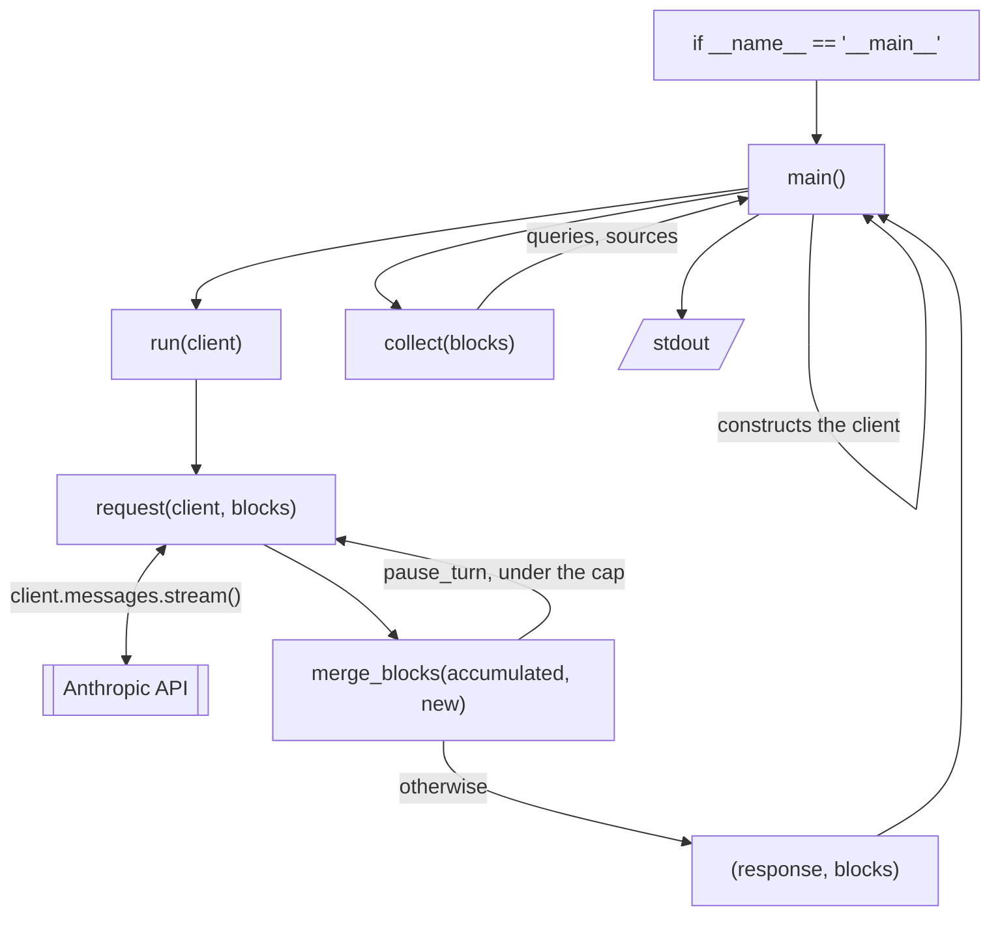

# Architecture

157 lines in one file, so "architecture" is a generous word. This page is not a
component diagram — there are no components. It is about the shape the file
holds and why, which is the part that would be easy to break while editing.

For what each function *does*, see the table in
[contributing.md](contributing.md); that is not repeated here.

## The flow

The loop is the whole design. Everything else is a straight line through it.

## `blocks` is the only state

One list, threaded as an argument from `run` into `request` and back through
`merge_blocks`. It accumulates across continuations; the `response` object is
transient and replaced each iteration.

Nothing is stored on a module, a class, or a client. That is why `run` can be
tested by handing it a fake and reading what came back — there is no state to set
up beforehand or tear down after, and two tests cannot contaminate each other.

The module-level names — `MODEL`, `MAX_TOKENS`, `MAX_CONTINUATIONS`, `TOOLS`,
`USER_QUERY` — are constants, not state. Nothing writes to them.

## The side-effect boundary

This is the structural fact worth knowing, and the one the file is arranged
around:

| Function | Touches the outside world |
|---|---|
| `field` | no |
| `block_key` | no |
| `merge_blocks` | no |
| `request` | **yes — the only network call in the file** |
| `run` | no, directly — reaches the API solely through `request` |
| `collect` | prints, but only on the error branch |
| `main` | constructs the client, prints, exits |

`client` appears in exactly three places: `main` builds one, `run` passes it
along, and `request` calls it. **There is one network seam in the entire
program.** Substituting a fake at that single point puts the whole continuation
loop under test, which is why the suite needs no HTTP mocking library and no
recorded fixtures — see [testing.md](testing.md).

The second thing that boundary buys: `merge_blocks`, easily the most intricate
logic here, sits on the pure side. That is not a coincidence. The decision it
makes — whether a resumed turn re-sent what we already hold — is genuinely hard
to reason about, so it was kept somewhere it could be tested exhaustively with
plain lists. Had it been folded into `run`, every test of it would have needed a
client.

## Why `collect` prints

It is the one function that breaks the pattern: a collector that also writes to
stdout. That is a wart, and it has a reason.

Server-side search failures arrive as HTTP 200, inline among the successful
results, as a block whose `content` is an object rather than a list. `collect` is
walking those blocks anyway and is the only place with the context to recognise
one. The alternative — returning errors alongside queries and sources for `main`
to print — would widen the return signature for a case that ideally never fires.

Whether that was the right call is arguable. It is at least deliberate.

## Where the shape would give way

The design assumes one question, asked once. Extending it past that means
undoing specific choices:

- **More than one query** — `USER_QUERY` is a module constant, and `request`
  hardcodes the message list. Both would need to take arguments.
- **Concurrency** — the threading of `blocks` is already safe, but `main`
  constructs the client and would need to hand it in.
- **Retry policy of your own** — the SDK's retries are relied on entirely;
  there is no seam to insert your own.

None of these are worth doing here. The example earns its keep by being readable
in one sitting, and [CONTRIBUTING.md](../CONTRIBUTING.md) rules them out.
